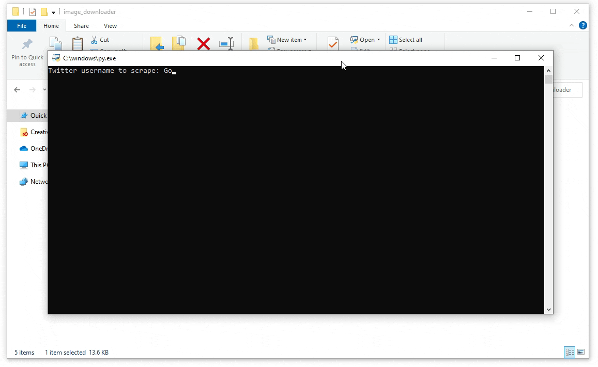
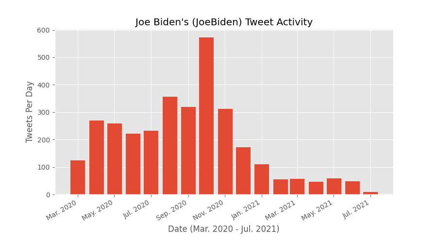
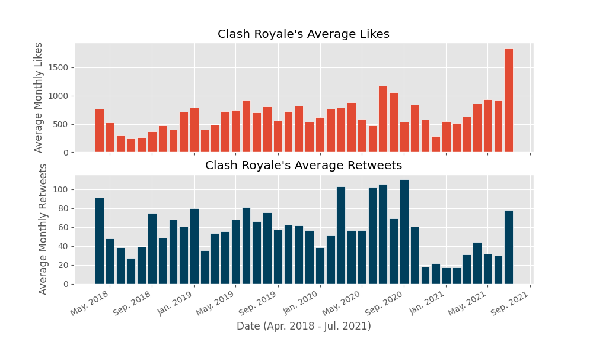
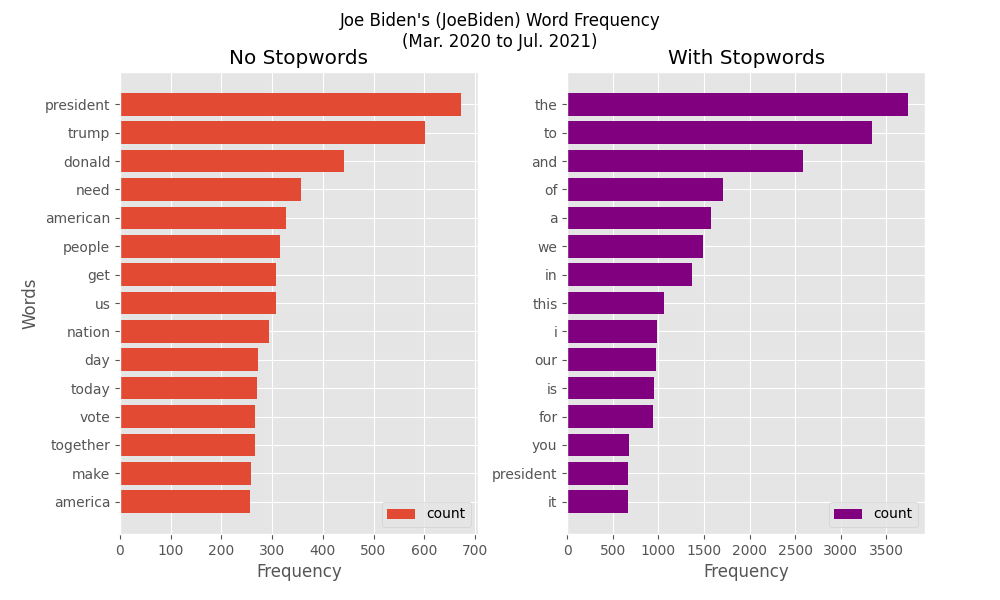

# (ARCHIVED) Twitter Scripts
#### No longer works - This repository contains various twitter scripts I made using Tweepy (via Twitter's v1 API), and it has not been maintained so these no longer work.

## Twitter Image Downloader
Download all the media files from a Twitter account's timeline. It will only download 3200 of the latest tweets of an account's timeline because of Twitter's API limitations. If an user tweeted more than 3200 tweets, this program will only get the latest 3200.

### Demo:

### How to Use:
##### Use program using inputs(). It will ask for the corresponding values then download the pictures OR: 
##### Use program by using run(username, downloadFormat, startTime, endTime, outputFolder), with startTime, endTime, and outputFolder being optional parameters.
- **username** is the Twitter username.
- **downloadFormat** options are 1, 2, or 3.
  - 1 is downloading all media thumbnails, including gifs and videos' thumbnails.
  - 2 is downloading all media in their original types, including videos and gifs as .mp4.
  - 3 is downloading all media in their original types in folders that differentiate the media type.
- **startTime** and **endTime** are optional parameters, where if inputted, it will only download tweets from that time frame.
  - The input has to be a datetime object.
- **outputFolder** is another optional parameter where you can specify where the media should be downloaded.
  - If there are no inputs, it will default to downloading to a folder with the username as the name.

### How it Works:
- First it gets all of the tweets from an account's timeline using getAllTweets(username).
- Then it filters the tweet for only media tweets using filterTweets(allTweets), with optional parameters of start and end time (has to be in datetime object) if you want a timeframe to download the media.
- Lastly, it will download all the media using the filtered tweets by either downloadMediaThumbnails(mediaTweets), downloadMediaAll(mediaTweets), or downloadMediaSeparate(mediaTweets) with an optional parameter of outputFolder.

------

# Twitter Statistics Graphing
**Limitation**: The Twitter API only has information on the latest 3,200 tweets, hence this program can only show the data of those tweets.

## Tweet Activity [`(Code)`](statistics_graphing/tweet_activity.py)
- Generates a bar chart of how often an user tweets per month.

From this chart, you can see the trend of when Joe Biden tweeted the most when it was the most important (October, right before the election) and it slowly started to decrease when he received his @POTUS Twitter account.

## Tweet Metrics [`(Code)`](statistics_graphing/tweet_metrics.py)
- Generates bar charts showing average monthly tweet likes and retweets.

## Tweet Lengths [`(Code)`](statistics_graphing/tweet_length.py)
- Generates bar charts showing average monthly character lengths per tweet and word count per tweet.

------- 

# Twitter User Word Frequency
**Limitation**: The Twitter API only has information on the latest 3,200 tweets, hence this program can only show the data of those tweets.

- Generates two horizontal bar charts of the 15 most common words tweeted by an user, one excluding stopwords like 'the', 'and', 'of', 'a', etc. and one including the stopwords.
- As demonstrated below, Joe Biden's most common words were 'president' and 'trump,' which makes sense because he was the presidential candidate in the 2020 U.S. election running against Donald Trump.

