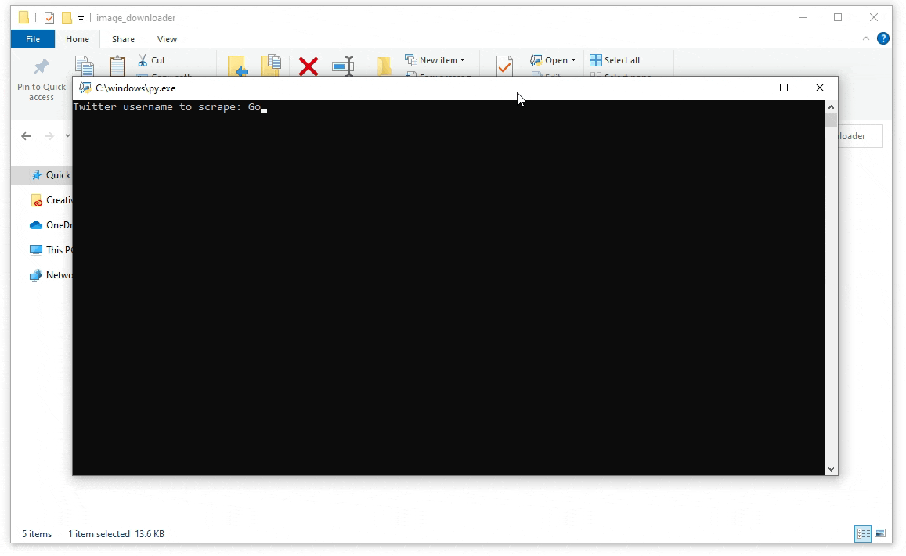

# Twitter Image Downloader
Download all the media files from a Twitter account's timeline. It will only download 3200 of the latest tweets of an account's timeline because of Twitter's API limitations. If an user tweeted more than 3200 tweets, this program will only get the latest 3200.

## Demo:

## How to Use:
#### Use program using inputs(). It will ask for the corresponding values then download the pictures OR: 
#### Use program by using run(username, downloadFormat, startTime, endTime, outputFolder), with startTime, endTime, and outputFolder being optional parameters.
- **username** is the Twitter username.
- **downloadFormat** options are 1, 2, or 3.
  - 1 is downloading all media thumbnails, including gifs and videos' thumbnails.
  - 2 is downloading all media in their original types, including videos and gifs as .mp4.
  - 3 is downloading all media in their original types in folders that differentiate the media type.
- **startTime** and **endTime** are optional parameters, where if inputted, it will only download tweets from that time frame.
  - The input has to be a datetime object.
- **outputFolder** is another optional parameter where you can specify where the media should be downloaded.
  - If there are no inputs, it will default to downloading to a folder with the username as the name.

## How it Works:
- First it gets all of the tweets from an account's timeline using getAllTweets(username).
- Then it filters the tweet for only media tweets using filterTweets(allTweets), with optional parameters of start and end time (has to be in datetime object) if you want a timeframe to download the media.
- Lastly, it will download all the media using the filtered tweets by either downloadMediaThumbnails(mediaTweets), downloadMediaAll(mediaTweets), or downloadMediaSeparate(mediaTweets) with an optional parameter of outputFolder.
