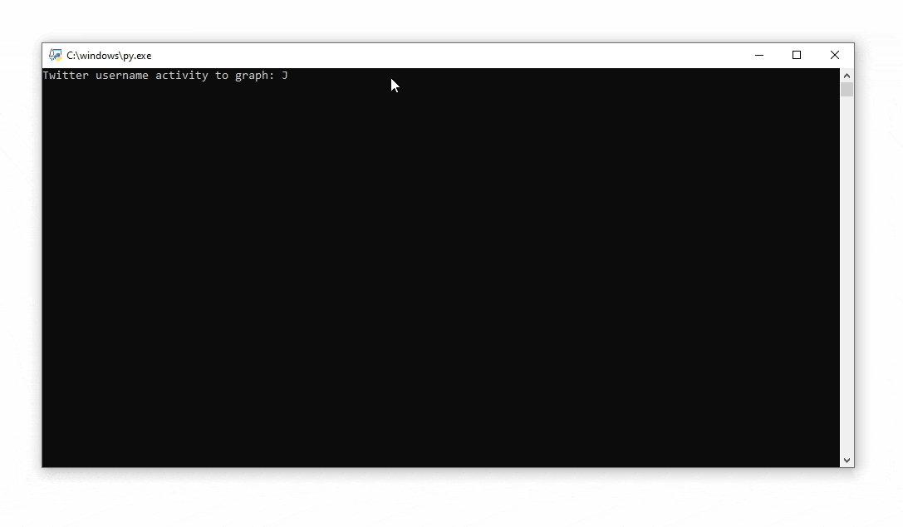
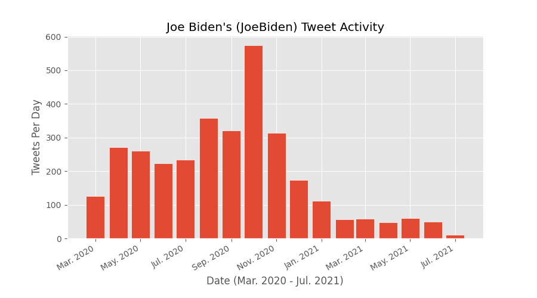
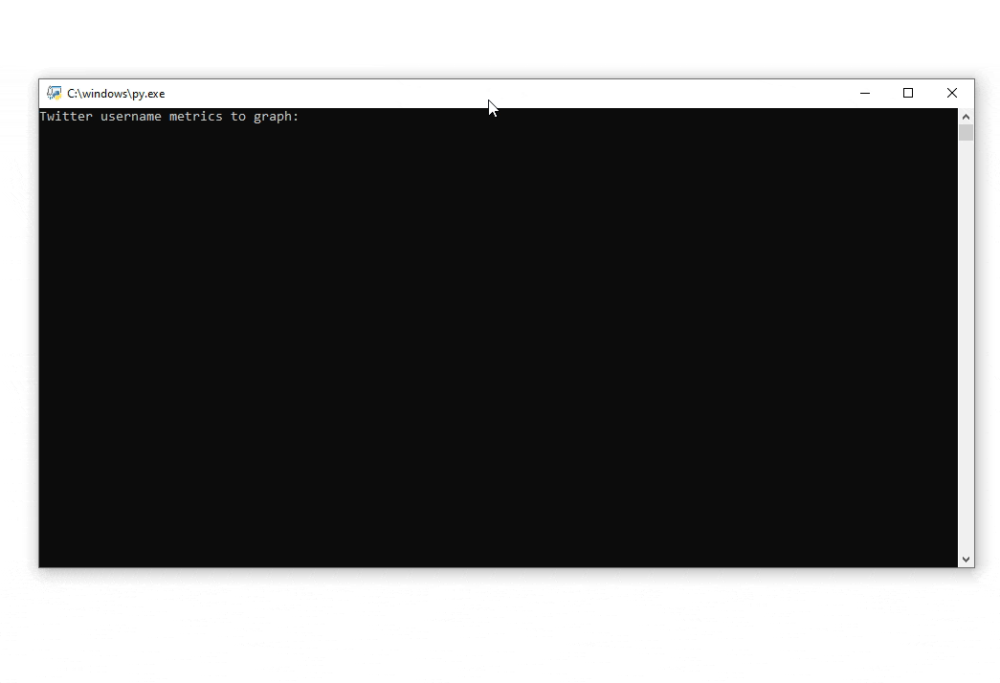
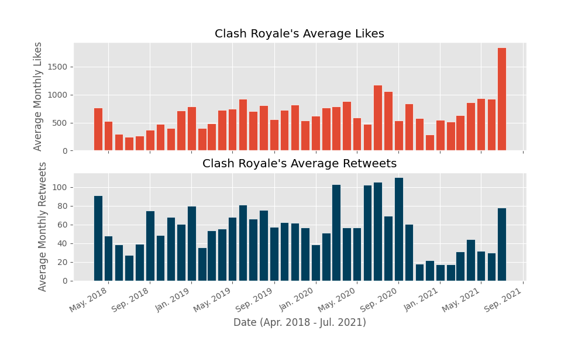
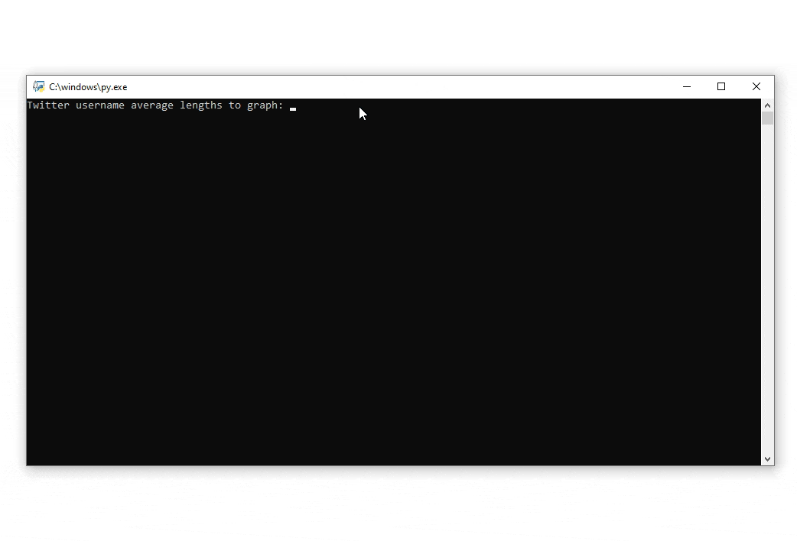
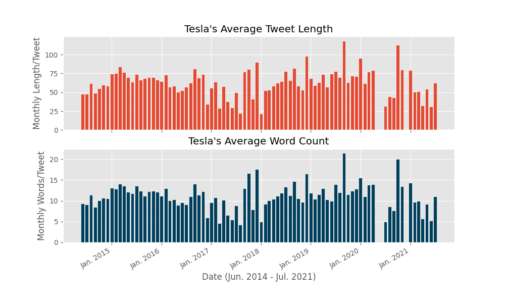

# Twitter Statistics Graphing
**Limitation**: The Twitter API only has information on the latest 3,200 tweets, hence this program can only show the data of those tweets.

## Tweet Activity [`(Code)`](tweet_activity.py)
- Generates a bar chart of how often an user tweets per month.

From this chart, you can see the trend of when Joe Biden tweeted the most when it was the most important (October, right before the election) and it slowly started to decrease when he received his @POTUS Twitter account.

## Tweet Metrics [`(Code)`](tweet_metrics.py)
- Generates bar charts showing average monthly tweet likes and retweets.

## Tweet Lengths [`(Code)`](tweet_length.py)
- Generates bar charts showing average monthly character lengths per tweet and word count per tweet.

