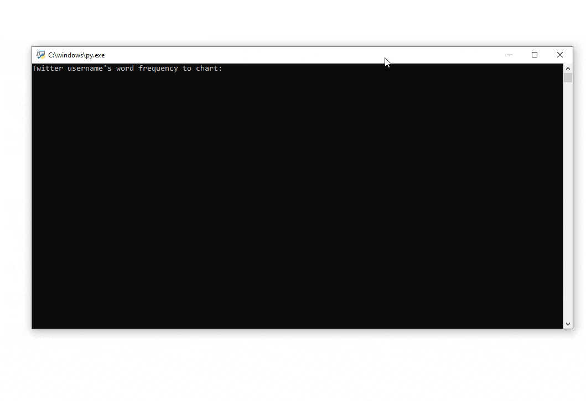
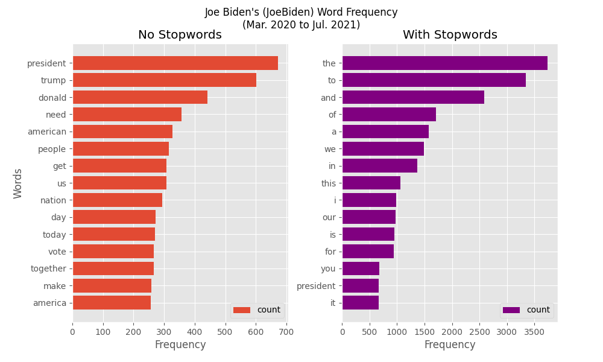

# Twitter User Word Frequency
**Limitation**: The Twitter API only has information on the latest 3,200 tweets, hence this program can only show the data of those tweets.

- Generates two horizontal bar charts of the 15 most common words tweeted by an user, one excluding stopwords like 'the', 'and', 'of', 'a', etc. and one including the stopwords.
- As demonstrated below, Joe Biden's most common words were 'president' and 'trump,' which makes sense because he was the presidential candidate in the 2020 U.S. election running against Donald Trump.

